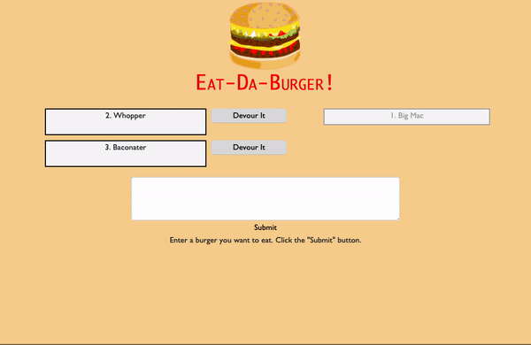

# Eat-Da-Burger!

## About
This burger logger will allow you to add your desired burgers to a MySql database and devour said burger at the click of a button.

## Getting Started
Follow [this link](addlinkhere) to visit the deployed site.

### Instructions
1. Follow the link above to visit the deployed site.
2. Add burgers to the database by using the form displayed below the list.
3. Click the "Devour It" button to move the burger to the list of eaten burgers. 

### Built With
* MySSQL
* Node.js
* Express.js
* Handlebars
* MVC design pattern / ORM

